What can we do to reduce racial inequalities in health? There are mountains of scientific reports, peer reviewed articles, reviews, monographs, books, and blog posts showing that US blacks have worse health indicators than whites. Although the magnitude of black-white differences in health have varied over time, the persistence of the racial gap in health is distressing and can be seen across a diverse array of environments and ways of measuring health: life expectancy, survival from cancer, death rates, cases of infectious diseases, accidents and crime victimization, among other outcomes.

This problem is echoed in striking language in a 2013 paper titled, "Eliminating Racial Disparities in Colorectal Cancer in the Real World: It Took a Village" by a group of public health cancer researchers from Delaware:

> "Those who are poor, underserved, or minorities are more likely to get cancer and die as a result of it than those who are rich or white. This is a fact, and it is the current reality of cancer care in the United States, as documented in thousands of peer-reviewed articles,…"
>
> — Grubbs et al. *J Clinical Oncology* 2013;31:1928.

Despite this depressing introduction, the quote above comes from a paper that attempts to make a case that a sustained, focused program aimed at reducing racial differences in cancer in Delaware was enormously successful, demonstrating "what can happen when the entire health care community of a state is mobilized toward a goal: eliminating health disparities in CRC [colorectal cancer]."

Briefly, the program contained 3 general aims:

1. A colorectal cancer screening program.
2. A cancer treatment program providing for the uninsured.
3. An emphasis on African American cancer disparity reduction.

In the paper the authors argue that the program resulted in the near-elimination of black-white inequalities in colorectal cancer:

> "By doing these common-sense things, we accomplished the following with respect to CRC health disparities from 2002 to 2009: elimination of screening disparities, equalization of incidence rates, reduction in the percentage of African Americans with regional and distant disease from 79% to 40%, and most importantly a near elimination of mortality differences."
>
> — Grubbs et al. *J Clinical Oncology* 2013;31:1929.

The primary pieces of evidence behind this claim come from Table 1 and Supplementary Figures 2 and 3:

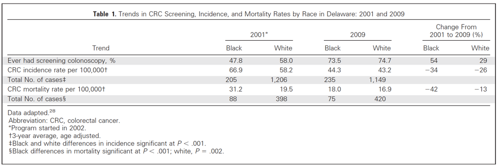

Table 1 shows rates of ever colonoscopy screening, incidence, and mortality in 2001 and 2009, and the relative change between the two time points. Without a doubt, black rates of screening increased more among blacks than whites, and both incidence and mortality declined more for blacks than whites, although no estimates of precision (only p-values, sigh) were included (a serious and unethical omission, in my opinion). Based on these two sets of measurements, and the fact that the program was implemented between 2001 and 2009 serves to bolster the authors' claims that the program reduced black-white differences.

However, Appendix Figures 2 and 3 complicate the story a little bit, since they show **trends** over the entire period, for colorectal cancer incidence (the authors circled the rates at the end of the period, I added an arrow indicating the general time of program implementation):

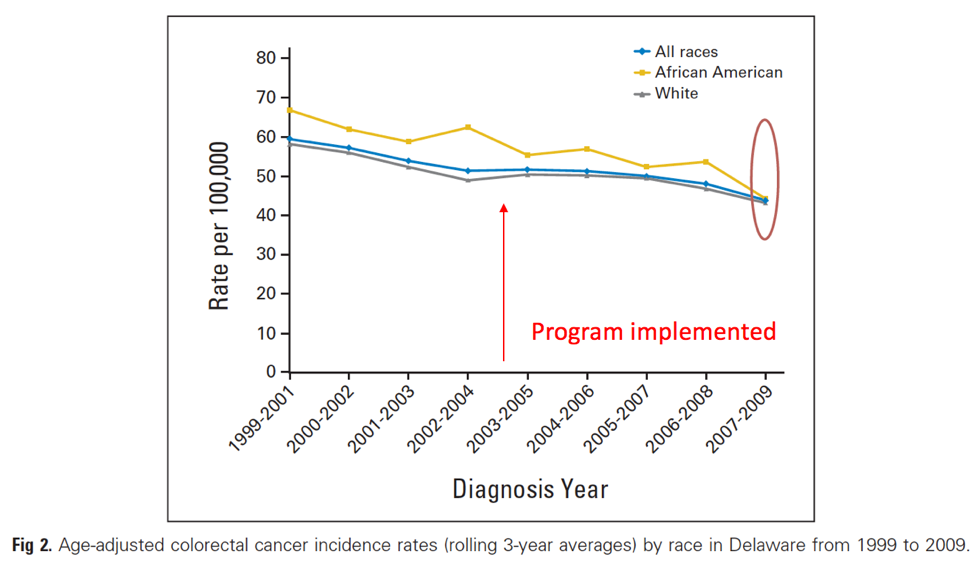

Here is the graph for mortality:

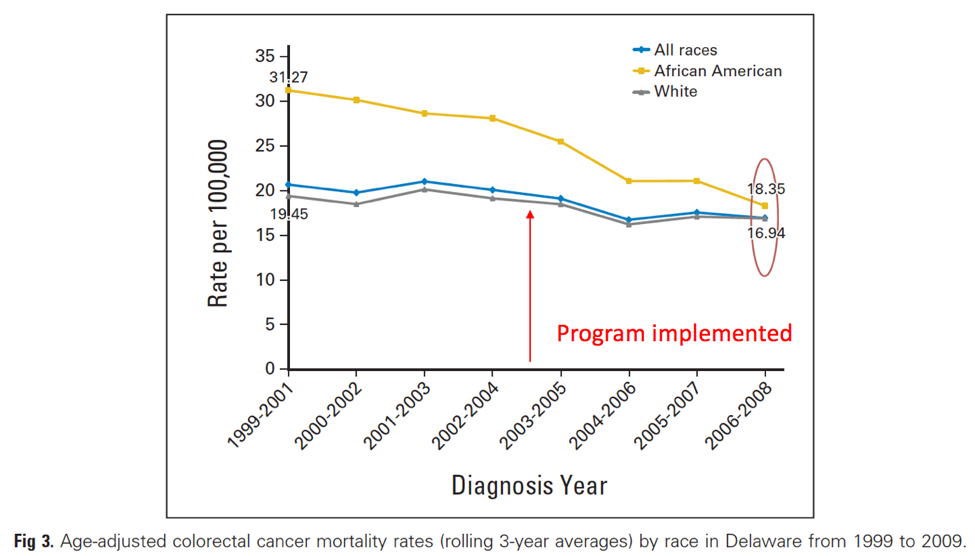

The authors are certainly correct that inequalities decreased. But one thing that is clearer from the figures than the table is that rates of cancer incidence and mortality were decreasing, particularly among blacks, **prior** to the program implementation, which complicates the authors' story since now we have an alternative explanation for the decrease in black-white inequalities at the end of the observation period: black rates were already declining faster than whites for reasons that have nothing to do with the program. I don't know what these might be, but it does make it harder to accept the authors' attribution of the elimination of inequality to the program, since clearly some part of this decrease looks as though it would have happened even if the program had not been implemented.

It is worth mentioning that national rates of colorectal cancer mortality have also been declining, and perhaps faster for blacks than whites. The graph below I generated from the National Cancer Institute's web-based tool (<https://seer.cancer.gov/faststats>):

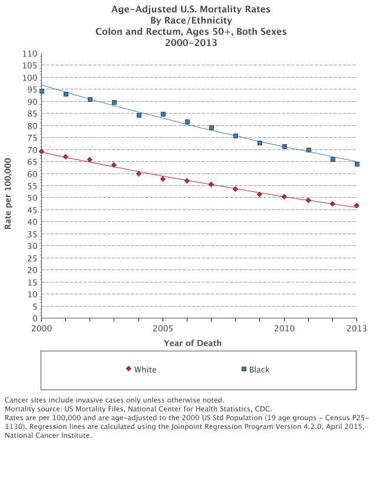

This at least suggest that there may be some factors operating nationwide that are driving down colorectal cancer mortality rates for both blacks and whites, which makes it harder to evaluate the researchers' claim that their program was responsible for the success in Delaware.

How can we adjudicate between these competing explanations to figure out whether the authors' argument for the impact of the program is more plausible than the argument that factors other than the program were already driving down rates of colorectal cancer incidence and mortality among blacks before the program was even implemented?

One way (I do not claim this is the only way) is to use something called an "interrupted time series" (ITS) study, which effectively uses the knowledge about when a program was implemented and assesses whether the program may have had an immediate impact on the rates, or possibly changed the trajectory of the outcome after the program was implemented. (There are many papers on this, but a rather nice overview is given by Gillings and colleagues in the *American Journal of Public Health* in 1981). The picture below gives the basic idea, which is using this type of study design to test whether some intervention "interrupts" pre-existing trends.

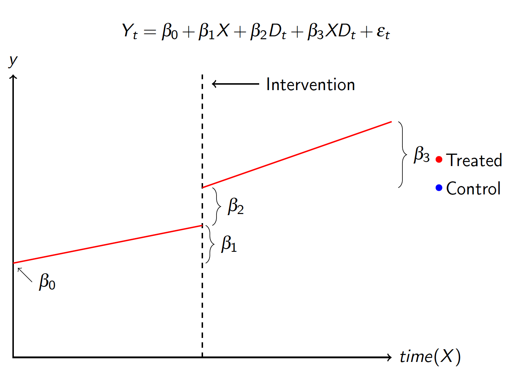

The key idea of ITS is to say, let's look at the outcome trends before the program (β1) and predict what would have happened in the absence of the program, assuming the trends would have continued in the same fashion (clearly a serious assumption), and compare this to what actually happened (since the program was actually implemented). In the figure above β2 represents any immediate impact of the program (less likely for most cancer indicators), but β3 represents a change in the trend that we could potentially attribute to the program. [Note that I have a color code for "control" there, but right now we could just think about the red lines as trends for either Delaware as a whole or for black residents of Delaware...more on that below]. If there are important differences between what we would have predicted without the program and what actually happened (under these assumptions), we may be more confident that the program actually "interrupted" the trends and had some impact on outcomes. (Leaving aside a lot of other complicating features and assumptions of ITS [autocorrelation, seasonality, time-varying confounders, etc.], which need to be taken seriously.)

## A simple analysis for Delaware mortality

I downloaded annual age-adjusted rates of colorectal cancer mortality for black and white individuals ages 50 and over from Delaware using the US National Cancer Institute's SEER database (<http://seer.cancer.gov>) for the years 1999 to 2013. Unfortunately, incidence rates are a little unstable among blacks and NCI suppresses some cases where numbers are small, but we could apply this same idea to trends in stage-specific incidence or cancer screening (which would be very interesting and perhaps a better example, since those are likely easier to change in short order than mortality).

I used the Stata routine *itsa*, written by Ariel Linden (and later described in an article published in *Stata Journal*) to estimate the impact of the introduction of the program in 2003 on colorectal cancer mortality rates among Delaware blacks. It isn't necessary to use this routine for an ITS analysis, but it makes some simple coding aspects easier and I was feeling lazy. I used the log mortality rate but the results are similar if one uses the absolute mortality rate.

I'll show the regression output below, but this picture tells the story pretty well. We tell Stata that an intervention occurred in 2003, and the software routine tests for a break in the time series in 2003 and any change in the slope of the mortality rate after 2003 (under assumptions of linearity, which, again, are important and need to be thoroughly explored, but hey, Grubbs et al. didn't even report standard errors!).

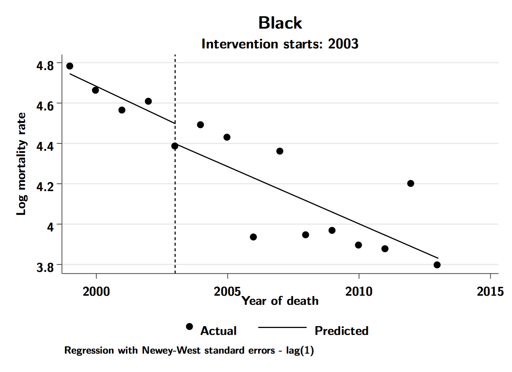

It's pretty straightforward to see that after the intervention began in 2003 there was little change in the cancer mortality rate among blacks, and that there was little change in the trajectory of the death rate after 2003. This is confirmed by the output from the regression analysis:

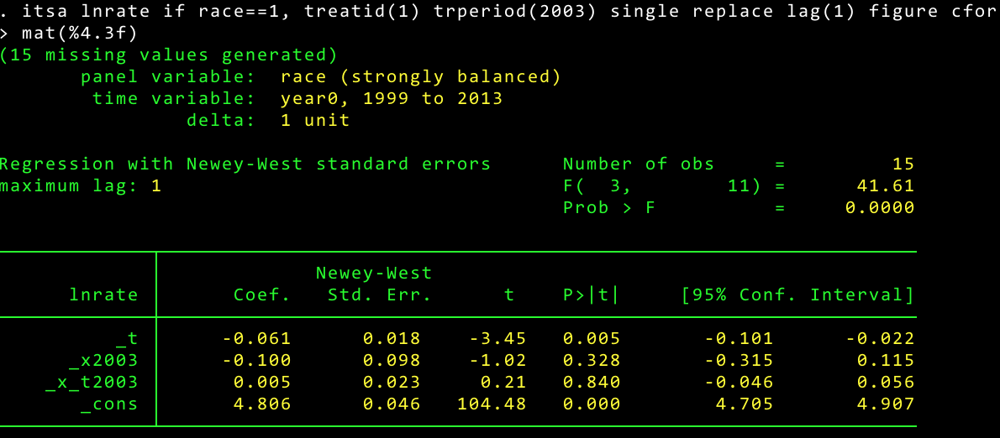

A few notes here. Exponentiating the constant term (4.8) gives the predicted colorectal cancer rate for blacks in 1999, which is approximately exp(4.8)=122 per 100,000 population, roughly equal to the actual rate of 119. The coefficient `_t` says that the black mortality rate was declining by roughly 6% per year prior to 2003, the coefficient for `_x2003` represents the change in the log mortality at 2003, which was near zero, and the coefficient for `_x_t2003` captures any **difference** in the log rate trend after the intervention, which is also effectively zero. The fact that the two trends before and after 2003 look nearly identical in the figure above corresponds with the fact that this latter coefficient is nearly zero.

This suggests that the program did not "interrupt" black mortality rates. The rate of decline was effectively the same before and after the program. But, you might ask, maybe comparing blacks after 2003 to their trajectory before 2003 isn't the right comparison. Since the program was focused on reducing racial inequalities, maybe we should be comparing black rates to white rates (or even modeling the black-white difference in rates)?

This is a fairly straightforward extension of ITS, which is just to include a *non-affected* control group as a comparison. I say "non-affected" but this is unlikely to be true here, since the program (at least the limited description of it in the paper) did not say that it only affected blacks in Delaware; presumably, whites may also have benefited. Nevertheless, it would seem valuable to use whites as a control group since the idea was for the program to narrow racial inequalities.

Below is another graph based on the ITS regression results, this time with Delaware whites as a control group:

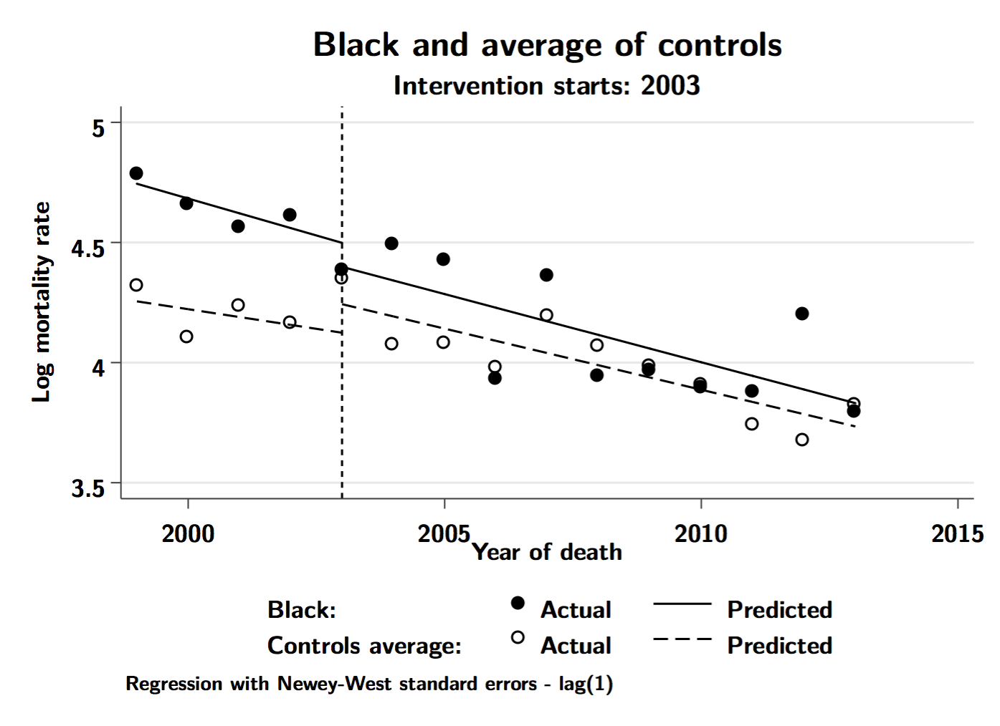

Again, a few things to notice here. First, white log mortality rates were on roughly the same trajectory as blacks prior to 2003 (although much lower in absolute terms). Second, the post-intervention trends also look generally similar, which is inconsistent with the idea that the program disproportionately benefited blacks. The regression estimates provide some numbers to back this up:

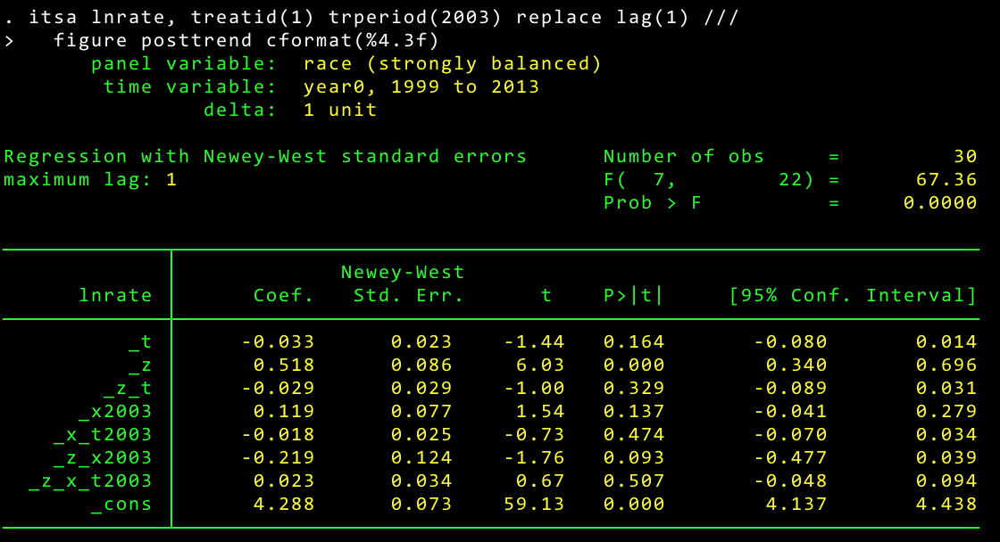

There are more parameters in this model, since we are not only estimating the program impact on blacks, but also on whites. Since in this case blacks are the "treated" group (`_z=1`) and whites are the control group (`_z=0`), the parameters have the following interpretations. The constant term (`_cons`) is the predicted white rate in 1999, so roughly exp(4.3)=74 per 100,000. The coefficient on `_t` is the white trend prior to 2003 (weakly declining), the coefficient on `_z` is the black-white difference in log mortality levels in 1999, which is large and obvious in the graph, and the coefficient `_z_t` is the difference in the pre-intervention trend between blacks and whites, which is rather small and suggests that blacks and whites were on similar trajectories prior to the intervention. The next set of coefficients give the change in the white rate at the time of the intervention (`_x2003`, small and positive), the change in the trend after the intervention among whites (`_x_t2003`, small, but still negative and showing declines in rates), the change in the black rate at the time of the intervention (`_z_x2003`, small and negative), and, most importantly, the difference in the post-intervention trend between blacks and whites (`_z_x_t2003`), which is also close to zero.

The *itsa* program also will display the post-intervention trends for the treated and control groups, and the difference between these two trends. The panel below gives this information and you can see that both blacks ("treated") and whites ("controls") were decreasing by roughly 5–6% annually. The black decline is larger than the white decline, but it is hard to make a case for a meaningful difference in the post-intervention trends with this data. The 95% confidence interval for the black-white difference in post-intervention trends goes from -4% to +3%.

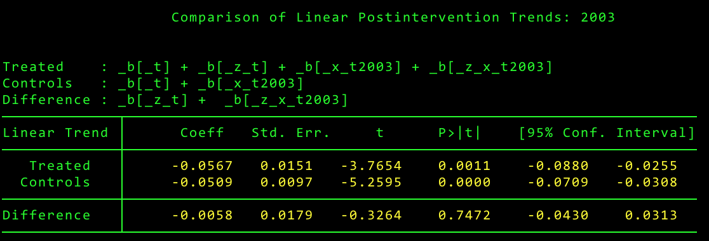

Okay, as one last example, rather than compare Delaware blacks to Delaware whites (since we might worry about whites also being affected by the program), we could instead compare Delaware blacks to blacks in a different state without the same program. I grabbed some additional data for blacks in Maryland, and we could instead use them as a control population. Here are the ITS results:

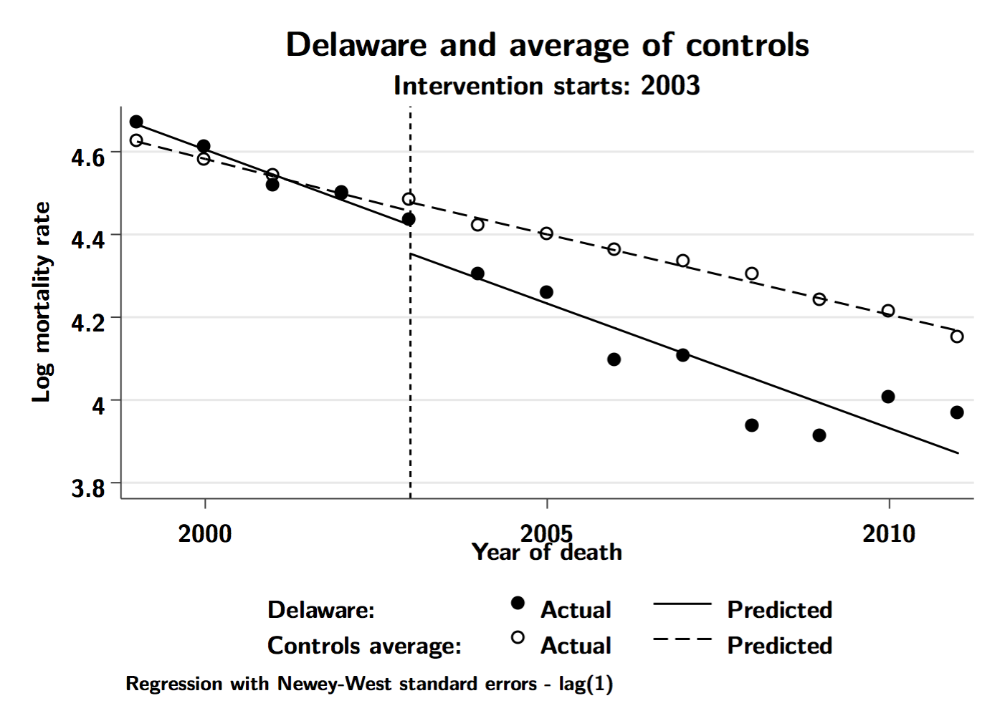

In this case it looks a little more plausible that the post-intervention trends show steeper declines for blacks in Delaware than in Maryland. The regression estimates are posted below:

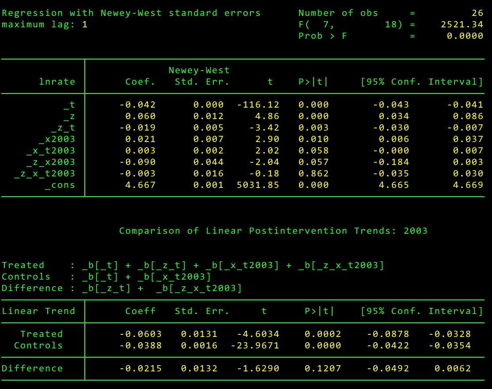

These estimates are obviously related to the graphs above, but the coefficient on the post-intervention product term that captures the difference in post-intervention trends between blacks in Delaware and Maryland is still small and close to zero. The post-trend estimates do show that the post-intervention trends are more negative (i.e., a steeper mortality decline) in Delaware (~6% annual decline) than in Maryland (~4% annual decline), but these are still not reliably different from one another, although this seems a more compelling story than we had before.

I am not submitting these analyses for publication, and this is not a serious attempt to estimate the program's impact, but the fact that no alternative explanations were even explored by Grubbs et al. is what really disappoints me, since these methods have been around for a long time. [Also, the data I used for these analyses are [here](ann-mort-states.txt), if anyone is interested].

## Who cares?

You may be wondering why I would take the trouble to write this post, given that the paper was published in 2013. Old news, right? But I began thinking more about this precisely because I have seen this paper cited a number of times (currently 60 citations according to [Google Scholar](https://scholar.google.ca/scholar?cites=13730541227240748658&as_sdt=2005&sciodt=0,5&hl=en)) recently as evidence of a program that has successfully "worked" to reduce black-white differences in health, which is a topic I do care about.

In a recent [interview](http://www.rwjf.org/en/culture-of-health/2016/12/a_conversation_onth.html?cid=xsh_rwjf_tw) on the "Future of Health Equity Research" with the Robert Wood Johnson Foundation, the sociologist David Williams, who has done some really fine work on black-white differences in health, responded to a question about interventions that have been shown to reduce health inequalities by citing the Delaware example:

> "And the State of Delaware provided colorectal cancer screenings and treatment for all residents but created targeted interventions and marketing campaigns for the black community, which experienced lower screening rates and higher colon cancer incidence rates than whites. As a result, screening rates among blacks rose from 48% in 2002 to 74% in 2009, which was equal to the improved screening rate for whites. Additionally, colon cancer incidence rates declined from 67 and 58 per 100,000 residents for blacks and whites respectively in 2002 to 45 per 100,000 residents among both populations in 2009."
>
> — David Williams

Elsewhere, this study also shows up as evidence cited by other researchers that **the program** eliminated black-white differences in colorectal cancer outcomes. Renee Williams and colleagues reviewed the epidemiology of colorectal cancer among African-Americans and noted the impact of the program implemented in Delaware:

> "The Delaware Cancer Advisory Council was established in 2001 with the goal of developing a Statewide cancer control program. This program provided reimbursement and covered 2 years of the cost of care for newly diagnosed CRC for the uninsured. Special programs to reach the African American community were put in place partnering with community organizations. Between 2001 and 2009 they equalized the screening rates between blacks and whites and significantly diminished the gaps in mortality. In 2001, the CRC mortality was 31.2 per 100,000 in blacks and 19.5 per 100,000 in whites in 2001. In 2009 these numbers decreased to 18.0 per 100,000 and 16.9 per 100,000, respectively [citing Grubbs et al. 2013]."
>
> — Williams et al. *Colorectal Cancer in African Americans: An Update*. Clinical and Translational Gastroenterology, 2016;7(7), e185.

And another recent paper by an esteemed group of public health researchers at the Harvard School of Public Health repeated this same claim:

> "We note that a recent comprehensive screening program deployed in the state of Delaware resulted in the elimination of stage at diagnosis disparities and in the reduction of survival disparities [citing Grubbs et al. 2013]."
>
> — Valeri et al. *Cancer Epidemiol Biomarkers Prev*; 25(1); 83–89.

Again, it is worth noting here that in both of these examples the entire reduction/elimination in black-white inequality in colorectal cancer is attributed *to the program*, yet, as we showed above, this claim is very hard to back up with solid evidence.

More distressingly, Grubbs et al. are still making serious claims that attribute the reduction or elimination of black-white inequalities in cancer outcomes **entirely to the program**. An [abstract](http://cancerres.aacrjournals.org/content/77/3_Supplement/IA29) of a conference presentation in the fall of 2016 says it all:

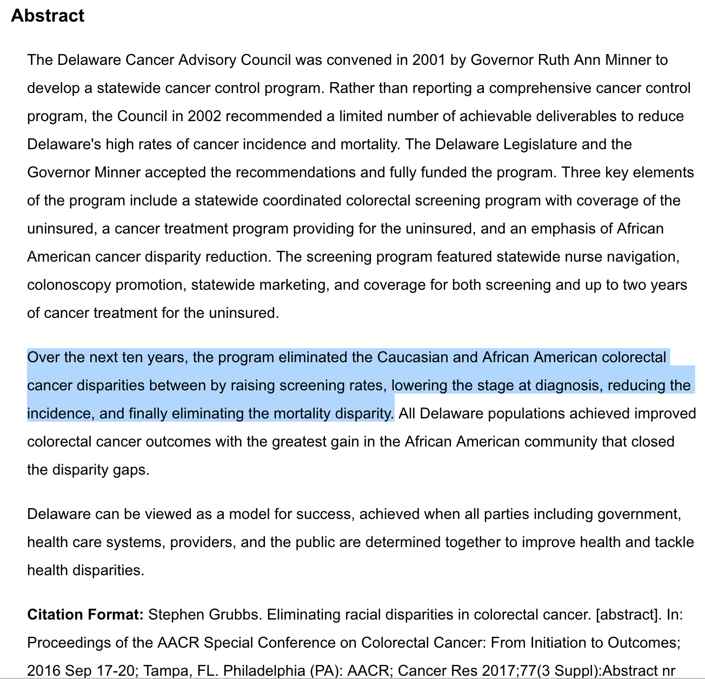

Finally, I should say, and want to emphasize, that the point of this post is not to try and embarrass or shame these researchers; they are no doubt committed to reducing the appalling gap in black-white health in their state, and I certainly applaud them for creating the support and political will to implement a program designed to reducing racial inequalities in colorectal cancer. And I am, of course, happy that black-white differences in many of these cancer-related outcomes have diminished in Delaware. Nor is my goal to question whether a program like the one in Delaware has produced some positive benefits; it may very well have, and it may have made an important contribution to the decline in black-white inequalities. But the program also costs money, and before we consider it "a model" for other states, we should get serious about understanding its impact. For all I know other states out there may be trying to replicate this program and anticipating the same result. If the program was not the chief reason why black mortality rates decreased faster than for whites, then we have little reason to expect that it can be replicated elsewhere, and that wastes resources that could be spent elsewhere.

My main motivation is to alert researchers (and consumers of research) that without a proper study design to isolate the impact of a particular program or intervention on health, we cannot know whether the program itself is responsible for the positive (or negative!) outcomes. What I hope is that, when considering whether or not their program was successful, researchers such as Grubbs et al. first remember to ask themselves, "What would have happened in the absence of the program?" This kind of thinking will help (I hope) to improve the reliability and validity of claims about the effectiveness of public health interventions. We can, and should, demand better evidence for the investments we make in public health.
